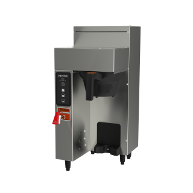
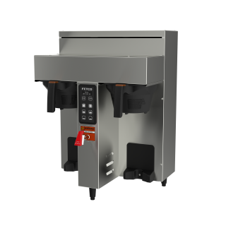
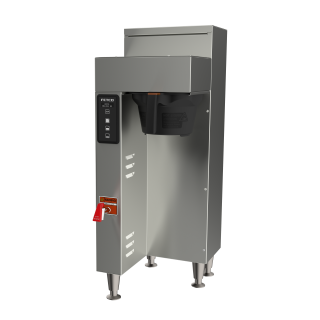
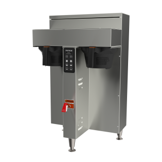

<link href="https://files.hoppel.us/css/reset_rick.css" rel="stylesheet"></link>`
<link href="https://files.hoppel.us/css/github-markdown.css" rel="stylesheet"></link

managed by: __Richard Hoppel__ | Controls Engineering Manager
| __rhoppel@fetco.com__ | mobile 847.400.7505

### [FETCO][FETCO link] |  ProjectName: [__CBS-1100-XV+__](.)

[OneDriveExternalLinkViewonly] | 

Component | Status| FETCO PN | REV |  Sub-Director | Notes (Links to PDF or other types of Docs)
--|---|--| -- | -- | --

---

### To Do

last update:  ___2017.MM.DD___

- [ ] do this

---

### Directory Structure

syntax:[\[Linked Directory\]](.)

#### \[[..]\] Up A Directory

- [.. README]

### CONTENT

- [Design](Design) Created by Blicharz
- [Design_20170818](Design_20170818) Modified by Hoppel for Production
- [Released](Released) Released Documents
- [Archive](Archive) Obsolete date

---

[..]: ..
[.. README]: ../README.html
[Archive_dir]: Archive
[Design_dir]: Design
[Design_README]: Design/README.html
[DisplayAssembly_dir]: DisplayAssembly
[DisplayAssembly_README]: DisplayAssembly/README.html
[Documentation_dir]: Documentation
[Drawings_dir]: Drawings
[Firmware_dir]: Firmware
[img_dir]: img
[PCB_dir]: PCB
[PCB_README]: PCB/README.html
[Released_dir]: Released
[Released_README]: Released/README.html
[README_html]: README.html
[README_markup]: README.md
[Switches_dir]: Switches
[FETCO link]: https://www.fetco.com/

---
[LocalProjectLocation]: file:///E:/OneDrive%20-%20Food%20Equipment%20Technologies%20Company/CONTROLS/TEMPLATE/
[OneDriveExternalLinkViewonly]: https://goo.gl/cFAFwC
[README_a_html]: file:///E:/OneDrive%20-%20Food%20Equipment%20Technologies%20Company/CONTROLS/TEMPLATE/README.html
