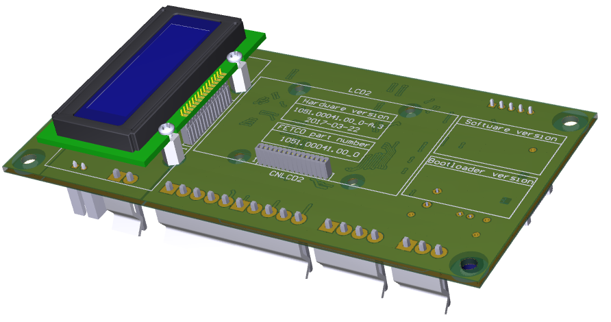
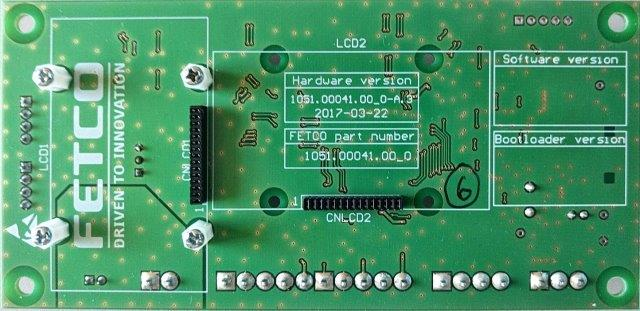
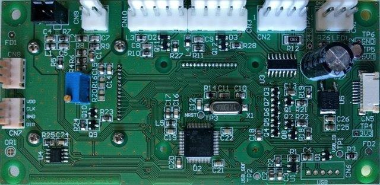
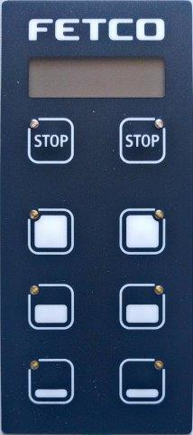
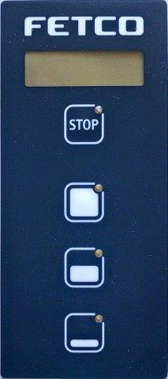
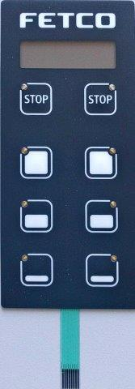
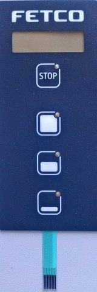

managed by: __Richard Hoppel__ | Controls Engineering Manager
| __rhoppel@fetco.com__ | mobile 847.400.7505

### [FETCO][FETCO link] |  ProjectName: [__CBS-1100-XV+/Released/DisplayAssembly__](.)
[OneDriveExternalLinkViewonly] | [LocalProjectLocation]  | [README.md link][README_a_html] (This File) |

Sigmatron Status| FETCO PN | TYPE | REV |  PCB Base/Link or Drawing NameLink | Notes
--|---|--| --
Prototype Build|[__1051.00041.00__][PCB_dir]|PCB Assembly |A.3| [PCB] | 100 Units ???
N/A|[1102.00371.00]|Sub-Assembly|A  |_Control Board Assembly_ | Future Build
N/A|[1102.00372.00]|Sub-Assembly|A  |_Dual Front Panel Assembly_ | Future Build
N/A|[1102.00375.00]|Sub-Assembly|A  |_Single Front Panel Assembly_ | Future Build
---
### To Do
last update:  ___2017.8.18___
- [ ] update Firmware
- [ ] replace Sample Software Installation Instructions
- [ ] generate membrane switch drawing from Visio
- [ ] Add more display assembly photos to help production
- [ ] Change beginning photo to show assembly
- [ ] clean up switches comments
---
### Significant Changes
last update:  ___2017.9.22___

Date  |  Change |  Notes
--|---|--
2017.10.16 | Replaced Standoff (1081.0065.00)and PCB Screw (1082.000111.00)
2017.8.22 | New |
2017.6.20  | INITIAL  |  New Format
  |   |
-----
### Directory Structure
syntax:[ \[Linked Directory\]](.)  Note: only ___Production Directories/Files___ are shared with our Production Partners
#### \[[..]\] Up A Directory
* [.. README]

#### [\[Drawings\]][Drawings_dir] ___Production___ Sub-Assembly Drawings
 FETCO PN  |  Rev |  Drawing Name
 --|---|--
[1102.00372.00]| A | _[Dual Front Panel Assembly]_
[1102.00375.00]| A | _[Single Front Panel Assembly]_
[1102.00371.00]| A | _[Control Board Assembly]_
[1051.00041.00][PCB_dir]| A | [PCB_README]

###### Dual Front Panel Assembly [1102.00372.00]
Item |QTY|FETCO PN|REV |Drawing Name
--|---|--
1|1|[1023.00290.00]|B|Plastic Front cover
2|1|[1102.00371.00]|B|Control Board Assembly]
3|1|[1058.00048.00]|B|Membrane Switch CBS-1100 Series, Dual
4|1| [1082.00083.00]|A| PCB Screw

###### Single Front Panel Assembly [1102.00375.00]
Item |QTY|FETCO PN|REV|Drawing Name
--|---|--
1|1|[1023.00290.00]|B|Plastic Front cover
2|1|[1102.00371.00]|B|Control Board Assembly
3|1|[1058.00047.00]|B|Membrane Switch CBS-1100 Series, Single
4|1| [1082.00083.00]|A|PCB Screw
###### Sub-Assembly [1102.00371.00]
Item |QTY|FETCO PN|REV|Drawing Name|Vendor Drawing
--|---|--
1|1|[1051.00041.00_0][PCB_dir]|A|Control Board PCB 24VDC|
2|4|[1081.00068.00]|A|LCD Display Standoff|
3|8|[1082.00124.00]|A|Standoff Screw|
4|1|[1102.00384.00]|A|LCD Display w/connector|

###### Sub-Assembly [1102.00384.00]
Item |QTY|FETCO PN|REV|Drawing Name
--|---|--
1|1|[1058.00050.00]|B|LCD Display
2|1|[1065.00012.00]|B|LCD Connector

#### [\[Documentation\]][Documentation_dir]
#### [\[Firmware\]][Firmware_dir]
File Name  |  Function |  Note
--|---|--
CBS11XXee.hex|Intel Hex format| This will change
CBS11XXee.bin | binary format| This will change
#### [\[Switches\]][Switches_dir]
File Name  |  Function |  Note
--|---|--
1058.00047.00 CBS Single | |
1058.00048.00 CBS Dual | |
1058.00049.00 TBS Dual | |
1058.00054.00 TBS Single | |
2017-01-10_TBS EE Overlay layouts.pdf | |
CBS Double Schematic Transparent.png | |
CBS Double Schematic.png | |
CBS Double Schematic2 Transparent.png | |
CBS Double Schematic2.png | |
CBS Single Schematic Transparent.png | |
CBS Single Schematic.png | |
CBS Single2 Schematic Transparent.png | |
Cbs_overlays .pdf | |
PF_CBS_Double.png | |
PF_CBS_Single.png | |
PF_CBS_Single2.png | |
PF_TBS_Double.png | |
PF_TBS_Single.png | |
UA-1241-R3 CIRCUIT DRAWING.DWG | |
UA-1241-R3 PRODUCT DRAWING.DWG | |
UA-1241-R3 PRODUCT DRAWING.PDF | |
UA-1242-R3 CIRCIUT DRAWING.DWG | |
UA-1242-R3 PRODUCT DRAWING.DWG | |
UA-1242-R3 PRODUCT DRAWING.PDF | |

#### [\[Test\]][Test_dir] ___Production___ Test Information
#### [\[img\]][img_dir]
###### [PCB_small]

Image
  |  Name |  Notes
--|---|--
  |   |
|   |
  |   |
  |   |
![AssemblyImage1] | |
![AssemblyImage2] | |
![AssemblyImage2a] | |
![AssemblyImage4] | |

---
[README_html]: README.html
[README_markup]: README.md
[FETCO link]: https://www.fetco.com/
[..]: ..
[.. README]: ../README.html
[Archive_dir]: Archive
[PCB_dir]: ../PCB
[PCB_README]: ../PCB/README.html
[PCB]: ../PCB/README.html
[Archive_dir]: Archive
[Documentation_dir]: Documentation
[Drawings_dir]: Drawings
[img_dir]: img
[Firmware_dir]: Firmware
[Switches_dir]: Switches
[Test_dir]: Test

---

[OneDriveExternalLinkViewonly]: https://goo.gl/1TYLST

[1102.00384.00]: Drawings/1102%20(SUB%20ASSEMBLIES)/1102.00384.00.pdf
[1102.00375.00]: Drawings/1102%20(SUB%20ASSEMBLIES)/1102.00375.00.pdf
[1102.00372.00]: Drawings/1102%20(SUB%20ASSEMBLIES)/1102.00372.00.pdf
[1102.00371.00]: Drawings/1102%20(SUB%20ASSEMBLIES)/1102.00371.00.pdf
[1023.00290.00]: Drawings/1023%20(PLASTIC%20PARTS%20-%20MOLDING,%20INJECTION)/1023.00290.00.pdf
[1058.00050.00]: Drawings/1058%20(SWITCHES%20LCD%20DISPLAYS%20LIGHT%20INDICATORS)/1058.00050.00.pdf
[1058.00047.00]: Drawings/1058%20(SWITCHES%20LCD%20DISPLAYS%20LIGHT%20INDICATORS)/1058.00047.00.pdf
[1058.00048.00]: Drawings/1058%20(SWITCHES%20LCD%20DISPLAYS%20LIGHT%20INDICATORS)/1058.00048.00.pdf
[1065.00012.00]: Drawings/1065%20(CONNECTOR)/1065.00012.00.pdf
[1082.00083.00]: Drawings/1082%20(SCREWS)/1082.00083.00.pdf
[1082.00124.00*]: Drawings/1082%20(SCREWS)/1082.00119.00_vendor.pdf
[1082.00124.00]: Drawings/1082%20(SCREWS)/1082.00124.00.pdf
[1081.00065.00*]: Drawings/1081%20(FASTENERS)/1081.00065.00_vendor.pdf
[1081.00068.00]: Drawings/1081%20(FASTENERS)/1081.00068.00.pdf

__Fix These__
[Software Installation]: Drawings/1108%20(ASSEMBLY%20BOARDS%20SWITCHING%20CONTROL%20&%20SOFTWARE)/1108.00036.00.pdf
[Harness, High 1151/1152]: Drawings/place-holder.md.html
[Software, FW]: Drawings/place-holder.md.html
[Software, BL]: Drawings/place-holder.md.html

[AssemblyImage1]: img/DisplayAssembly1.PNG
[AssemblyImage2]: img/DisplayAssembly2.PNG
[AssemblyImage2a]: img/DisplayAssembly2a.PNG
[AssemblyImage3]: img/DisplayAssembly3.PNG
[AssemblyImage4]: img/DisplayAssembly4.PNG
