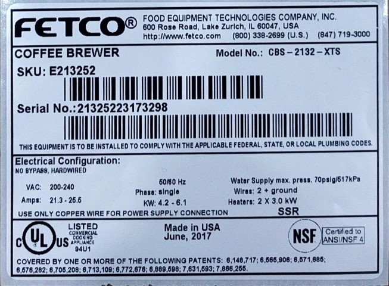

managed by: __Richard Hoppel__ | Controls Engineering Manager
| __rhoppel@fetco.com__ | mobile 847.400.7505

### [FETCO][FETCO link] |  ProjectName: [__CBS-1100-XV+/Released__](.)
[OneDriveExternalLinkViewonly] |

Component | Status | FETCO PN | TYPE | REV |  PCB Base/Link or Drawing NameLink | Notes
--|---|--| --
--|---|--| --
--|---|--| --

---
### To Do
last update:  ___2017.9.22___
- [ ] update Manual
- [x] add Wire Harness Docs
- [x] Top Level drawings need updating
- [ ] Finish System Test Procedures
---
### Significant Changes
last update:  ___2017.9.22___

Date  |  Change |  Notes
--|---|--
2017.9.22 | Re-structured README.md | Created Sub-Assembly DisplayAssembly; added Renderings
2017.08.18 | Update Drawings | Change base product from CBS-2100ee to CBS-1100 updated all drawings
2017.08.10 | Split PCB Documents | Separated PCB Info into a separate sub-directory and README
2017.6.20  | INITIAL  |  New Format
  |   |
-----
### Directory Structure
syntax:[ \[Linked Directory\]](.)  Note: only ___Production Directories/Files___ are shared with our Production Partners

#### \[[..]\] Up A Directory
* [.. README]

#### [\[Drawings\]][Drawings_dir] Main Assembly Production Drawings
###### CBS-1100-XV+ Main Assemblies
#### [\[Drawings\]][Drawings_dir] ___Production___ Main Drawings
 FETCO PN  |  Rev |  Drawing Name
 --|---|--
[1101.00341.00]|A| [__CBS-1131__][1101.00341.00]
[1101.00340.00]|A| [__CBS-1132__][1101.00340.00]
[1101.00342.00]|A| [__CBS-1151__][1101.00342.00]
[1101.00339.00]|A| [__CBS-1152__][1101.00339.00]

###### USB Connector
FETCO PN  |  Rev |  Drawing Name
 --|---|--
[1058.00055.00] |B | [USB Connector][1058.00055.00] [1058.00055.00*] [1058.00055.00**]

###### Wire Harnesses for CBS-1100-XV+
FETCO PN  |  Rev |  Drawing Name
--|---|--
[1402.00098.00]|B| [HARNESS, LOW AMP, CBS-1130-XV+, UL][]
[1402.00098.01]|A| [HARNESS, LOW AMP, CBS-1131-XV+, UL][]
[1402.00098.02]|A| [HARNESS ADDITION, LOW AMP, CBS-1132-XV+, UL][]
[1402.00100.00]|A|  [Harness Addition, High 1130][]
[1402.00097.00]|A| [HARNESS, LOW AMP, CBS-1150-XV+, UL][]
[1402.00097.01]|B| [HARNESS, LOW AMP, CBS-1151-XV+, UL][]
[1402.00097.02]|A|  [HARNESS ADDITION, LOW AMP, CBS-1152-XV+, UL][]
[1402.00101.00]|A|  [Harness, High 1150][]

#### [\[Documentation\]][Documentation_dir]
#### [\[DisplayAssembly\]][DisplayAssembly_dir]
* [DisplayAssembly_README]

#### [\[PCB\]][PCB_dir]
* [PCB_README]

#### [\[Test\]][Test_dir]
* [Test_README]

#### [\[img\]][img_dir]

Image
  |  Name |  Notes
--|---|--
 | |
| |
| |
| |
| |
---
[..]: ..
[.. README]: ../README.html
[Archive_dir]: Archive
[Design_dir]: Design
[Design_README]: Design/README.html
[DisplayAssembly_dir]: DisplayAssembly
[DisplayAssembly_README]: DisplayAssembly/README.html
[Documentation_dir]: Documentation
[Drawings_dir]: Drawings
[img_dir]: img
[Firmware_dir]: Firmware
[PCB_dir]: PCB
[PCB_README]: PCB/README.html
[Released_dir]: Released
[Released_README]: Released/README.html
[README_html]: README.html
[README_markup]: README.md
[Test_dir]: Test
[Test_README]: Test/README.html
[FETCO link]: https://www.fetco.com/

[1101.00341.00]: Drawings/1101%20(MAIN%20ASSEMBLY)/1101.00341.00.pdf
[1101.00340.00]: Drawings/1101%20(MAIN%20ASSEMBLY)/1101.00340.00.pdf
[1101.00342.00]: Drawings/1101%20(MAIN%20ASSEMBLY)/1101.00342.00.pdf
[1101.00339.00]: Drawings/1101%20(MAIN%20ASSEMBLY)/1101.00339.00.pdf

[1058.00055.00]: Drawings/1058%20(SWITCHES%20LCD%20DISPLAYS%20LIGHT%20INDICATORS)/1058.00055.00.pdf
[1058.00055.00*]: Drawings/1058%20(SWITCHES%20LCD%20DISPLAYS%20LIGHT%20INDICATORS)/1058.00055.00_vendor_sht2.pdf
[1058.00055.00**]: Drawings/1058%20(SWITCHES%20LCD%20DISPLAYS%20LIGHT%20INDICATORS)/1058.00055.00.pdf

[1402.00098.00]: Drawings/1402%20(WIRE%20HARNESSES)/1402.00098.00.pdf
[1402.00098.01]: Drawings/1402%20(WIRE%20HARNESSES)/1402.00098.01.pdf
[1402.00098.02]: Drawings/1402%20(WIRE%20HARNESSES)/1402.00098.02.pdf
[1402.00100.00]: Drawings/place-holder.md.html
[1402.00097.00]: Drawings/1402%20(WIRE%20HARNESSES)/1402.00097.00.pdf
[1402.00097.01]: Drawings/1402%20(WIRE%20HARNESSES)/1402.00097.01.pdf
[1402.00097.02]: Drawings/1402%20(WIRE%20HARNESSES)/1402.00097.02.pdf
[1402.00101.00]: Drawings/place-holder.md.html

[HARNESS, LOW AMP, CBS-1130-XV+, UL]: Drawings/1402%20(WIRE%20HARNESSES)/1402.00098.00.pdf
[HARNESS, LOW AMP, CBS-1131-XV+, UL]: Drawings/1402%20(WIRE%20HARNESSES)/1402.00098.01.pdf
[HARNESS ADDITION, LOW AMP, CBS-1132-XV+, UL]: Drawings/1402%20(WIRE%20HARNESSES)/1402.00098.02.pdf
[Harness, High 1131/1132]: Drawings/place-holder.md.html
[HARNESS, LOW AMP, CBS-1150-XV+, UL]: Drawings/1402%20(WIRE%20HARNESSES)/1402.00097.00.pdf
[HARNESS, LOW AMP, CBS-1151-XV+, UL]: Drawings/1402%20(WIRE%20HARNESSES)/1402.00097.01.pdf
[HARNESS ADDITION, LOW AMP, CBS-1152-XV+, UL]: Drawings/1402%20(WIRE%20HARNESSES)/1402.00097.02.pdf

---
[LocalProjectLocation]: file:///H:/OneDrive%20-%20Food%20Equipment%20Technologies%20Company/CONTROLS/CBS-1100-XV+
[OneDriveExternalLinkViewonly]: https://goo.gl/hmktH1
[README_a_html]: file:///H:/OneDrive%20-%20Food%20Equipment%20Technologies%20Company/CONTROLS/CBS-1100-XV+/Released/README.html
